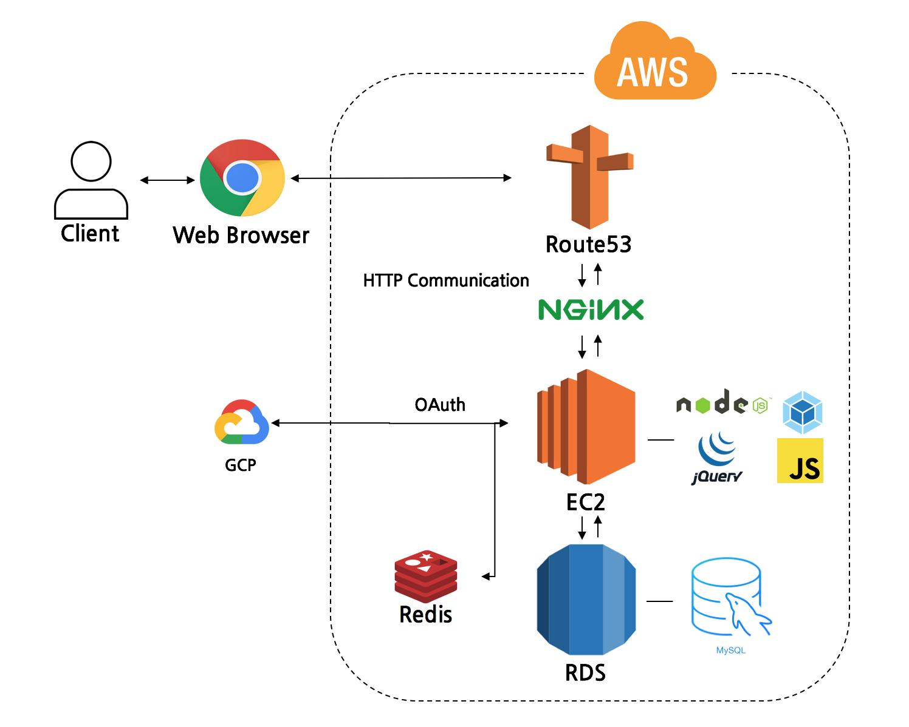

<link rel="stylesheet" type="text/css" href="docs/styles.css">

# Freemed EMR
이 repository는 비영리 민간단체 Freemed의 EMR(Electronic Medical Record) 웹 어플리케이션입니다.

* **Freemed**는 매주 토요일마다 서울역에서 운영하는 간이 진료소에서 수혜자분들의 접수부터 복약 지도까지 자체 제작한 EMR을 통하여 진행합니다.
* 모든 처방기록을 데이터베이스에 저장하여 수혜자 분들이 장기적으로 좋은 치료를 받을 수 있도록 돕고 있습니다.
* Freemed EMR은 Freemed 소속 IT 기획본부 단원들이 관리합니다.
* 링크: http://emr.freemedicals.org

## System Architecture (시스템 구성)

다음은 프로젝트에서 사용된 기술 스택과 다불어 시스템 아키텍처를 나타낸 구조도입니다.


이와 같이 진료소를 운영하는 Freemed 는원 및 의사,도약사 분들은 크롬브라우저를 통하여 EMR을 이용합니다. jQuery 기반 클라이언트를 통하어 수혜자의 기록을 조회하고 처방 기록을 다시 작성할 수 있습니다. API 서버는 Node.js 기반의 Express 프레임워크를 통하여 클라이언트와 통신하고 수혜자와 약 기록은 MySQL 기반의 데이터베이스에 저장됩니다.

EMR에서 제공하는 기능은 크게 다음과 같이 분류됩니다.
- 접수 - 수혜자가 등록되어있는 수혜자인지를 확인한 후 신규 수혜자라면 기본 정보를 입력
- 예진 - 수혜자의 기본적인 건강 수치를 체크하고 C.C를 기록
- 본진 - 의사분이 예진의 기록을 기반으로 진료를 하고 처방을 내림
- 약국 - 처방전을 바탕으로 약을 조제하고 복약지도를 함
- OCS - 접수환자의 기록을 보여줌
- 약국 재고 관리 - 약의 처방 내역 및 재고표를 보여줌

## Getting Started (빌드 및 실행 방법)

1. Repository를 clone한 후 IT 기획본부장에게 문의하여 Config 폴더를 받아서 루트 디렉토리 안에 복사해 넣습니다.
2. Node.js, Docker를 설치합니다.
3. 루트 디렉토리로 이동 후에 `yarn` 명령어를 통하여 관련 패키지를 설치합니다.
4. Docker를 실행하고 다음과 같은 명령어를 통하여 redis를 실행합니다.
    ```
    yarn docker // docker-compose up --build -d
    ```
5. 프로젝트를 빌드합니다.
    ```
    yarn build // 기본적으로 watch 옵션이 붙어있음
    ```
6. 다른 탭을 열어서 서버를 실행합니다.
    ```
    yarn start:dev
    ```
7. http://localhost:4000으로 이동하여 EMR이 잘 실행되는지 확인한다.

## Description for Database Permission

각각의 권한은 해당 4자리의 정수 코드를 따릅니다.

```
doctor 6000
3partLeader 7000
pharmacist 8000
super 9000
```
